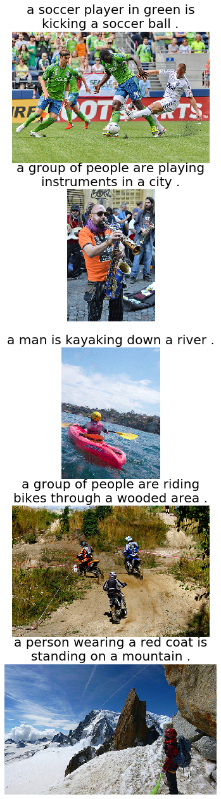

# Image-Captioning-PyTorch
Image captioning models based on ResNet50, LSTM (w/ and w/o attention) and the Transformer

Please run `setup.sh` to install packages and download the dataset before running.

The figures below illustrate an example of captions generated by LSTM-based (upper) and Transformer-based model (lower), for five images randomly selected from the test set split of Flickr30K. 
While LSTM decoder with attention mechanism has difficulty recognising the number of people and some details including clothes colour and specific categories of object (misclassifying bike as bicycle, misclassifying kayaking as surfing, ignoring instruments). 
The Transformer as the decoder significantly outperforms LSTM. The generated captions describe the images more accurately and have more diversity compared to the captions generated by LSTM decoder, in
which four out of the five sentences start with 'a man'.

*Transformer*

*LSTM*
